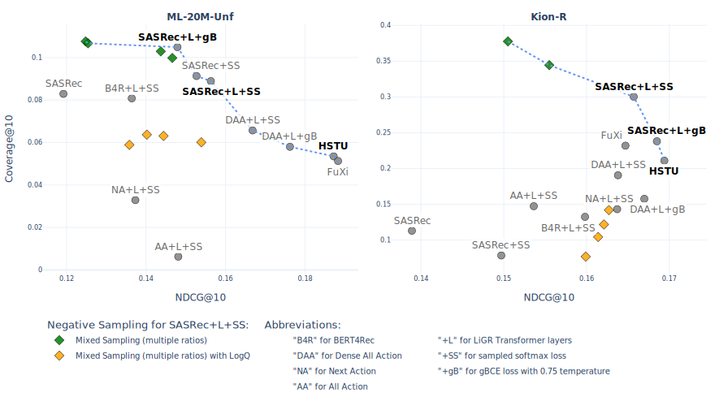
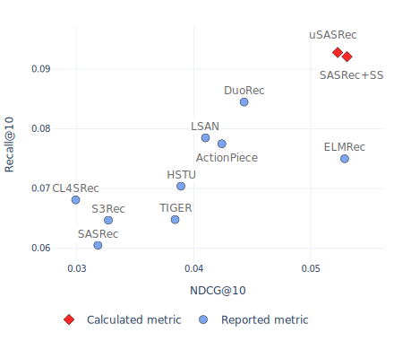
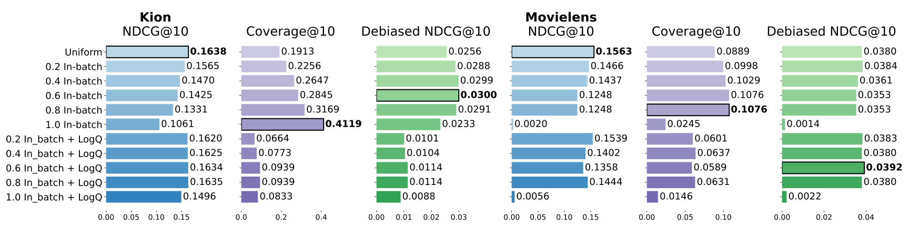

# "uSASRec: From Realistic Benchmarking of Modular Enhancements for Transformer-based Recommendations"

This repository contains model implementations, benchmarking code, link to processed datasets and additional materials for the paper.

### The Pareto-front of top models from our benchmark


### Backbone models

We borrow [RecTools](https://github.com/MobileTeleSystems/RecTools) implementations of backbone models SASRec and BERT4Rec and provide implementations of multiple [modular enhancements for Transformer-based models](src/models/transformers/) on top of them. 

We also test the quality of selected backbone implementations, provinding reproducibilite test results in the "Additional materials" section of current file.

### Processed datasets

Our processed datasets with leave-one-out and time-based splits can be downloaded [online](https://disk.yandex.ru/d/v7yUTbJXYvd0kA).

### Code to reproduce HSTU and FuXi-𝛼
Instructions to reproduce results for HSTU and FuXi-𝛼 models on our data splits are located in a [separate repository](https://anonymous.4open.science/r/hstu_benchmark-4530)

### Common Academic Benchmarks Results

For each user, we hold the final interaction for the test set and the previous interactions for the validation set
- **Movielens datasets**

During our experiments, we found that HSTU and FuXi-𝛼 repositories provided MovieLens datasets processing code, which differed from the typical practice for these datasets because of not preserving the original
items’ interactions order for a user in case of timestamp collisions. This resulted in a modified order of training sequences and a 25% change in the test set. We used the original code repositories for model training and recalculated their models’ metrics on the identical training and test data to other models in the benchmark.

| Dataset | Scale      | Metric    | Reported   |            |        | Calculated       |                |  |            |
|---------|------------|-----------|------------|------------|--------|-----------|----------------|--------------|------------|
|         |            |           | SASRec MoL | HSTU       | Fuxi-α | SASRec+SS | uSASRec | HSTU         | Fuxi-α     |
| ML-1M   | 1-4 layers | R@10      | 0.3079     | 0.3097     | -      | 0.2929    | 0.3133         | 0.3037       | **0.3164** |
|         |            | N@10      | -          | 0.172      | -      | 0.1684    | 0.1772         | 0.1719       | **0.1813** |
| ML-20M  | 1-4 layers | R@10      | 0.3114     | 0.3252     | 0.3353 | 0.3127    | 0.3289         | 0.3431       | **0.3553** |
|         |            | N@10      | -          | 0.1878     | 0.1954 | 0.1829    | 0.1966         | 0.2029       | **0.2118** |
| ML-20M  | 8 layers   | R@10      | -          | **0.3567** | 0.353  | 0.0465    | 0.3457         | 0.3464       | 0.3468     |
|         |            | N@10      | -          | 0.2106     | 0.2086 | 0.0231    | **0.2107**     | 0.2040       | 0.2043     |

- **Amazon datasets**

| Dataset | Metric | Reported | | | | | | | | Calculated | |
|---------|--------|----------|-|-|-|-|-|-|-|-----|-|
| | | SASRec | HSTU | S3Rec | LSAN | DuoRec | CL4SRec | TIGER | ActionPiece | SASRec+SS | uSASRec | HSTU | Fuxi-α |
| Beauty | R@10 | 0.0605 | 0.0704 | 0.0647 | 0.0785 | 0.0845 | 0.0681 | 0.0648 | 0.0775 | 0.0921 | **0.0928** | 0.0788 | 0.0809 |
| | N@10 | 0.0318 | 0.0389 | 0.0327 | 0.041 | 0.0443 | 0.0299 | 0.0384 | 0.0424 | **0.0531** | 0.0523 | 0.0439 | 0.0451 |
| Sports | R@10 | 0.0350 | 0.0414 | 0.0385 | 0.0481 | 0.0498 | 0.0387 | 0.04 | 0.05 | **0.0569** | 0.0560 | 0.0437 | 0.0437 |
| | N@10 | 0.0192 | 0.0215 | 0.0204 | 0.0264 | 0.0262 | 0.0171 | 0.0225 | 0.0264 | 0.0314 | **0.0323** | 0.0243 | 0.0244 |
| Toys | R@10 | - | - | 0.07 | 0.0711 | - | - | 0.0712 | - | **0.0970** | 0.0939 | 0.0778 | 0.0765 |
| | N@10 | - | - | 0.0376 | 0.037 | - | - | 0.0432 | - | **0.0580** | 0.0538 | 0.0450 | 0.0437 |

**Beauty dataset illustrated:**



### Hyperparameters for all datasets

We tuned hyperparamaters from the following grid:
- emb_dim (n_factors): [50, 64, 128, 256]
- n_blocks: [1, 2, 4]
- n_heads: [1, 2, 4, 8]
- dropout_rate: [0.1, 0.2, 0.3, 0.5]
- ff_emb_mult (LiGR only): [1, 2, 4]
- sequence_max_len: [50, 100, 200]
- n_negatives: [128, 256]

We used constant learning_rate 0.001 for all datasets.
We selected max number of epochs (100 or 200) and patience (10 or 50) depeding on dataset size and convergence speed.

Selected hyperparamters are equal for both realistic benchmark in our paper and other common academic benchmarks:

| Hyperparameter          | ML-1M | ML-20M | Beauty | Sports | Toys  | Kion  | BeerAdvocate |
|-------------------------|-------|--------|--------|--------|-------|-------|--------------|
| emb_dim                 | 64    | 256    | 64     | 64     | 64    | 256   | 256          |
| n_blocks                | 2     | 4      | 1      | 1      | 1     | 2     | 4            |
| n_heads                 | 1     | 8      | 1      | 1      | 1     | 2     | 2            |
| dropout_rate            | 0.1   | 0.2    | 0.2    | 0.2    | 0.2   | 0.1   | 0.3          |
| ff_emb_mult (LiGR only) | 4     | 4      | 4      | 2      | 1     | 4     | 4            |
| sequence_max_len        | 200   | 200    | 50     | 50     | 50    | 50    | 100          |
| n_negatives             | 256   | 256    | 256    | 256    | 256   | 256   | 256          |
| max_epochs              | 100   | 100    | 200    | 200    | 200   | 100   | 100          |
| patience                | 50    | 50     | 50     | 50     | 50    | 50    | 10           |
| learning_rate           | 0.001 | 0.001  | 0.001  | 0.001  | 0.001 | 0.001 | 0.001        |

# Reproduce our results:
## Installation

Clone this repository.

Create virtual environment:
```
cd transformers_benchmark
python3 -m venv .venv
source .venv/bin/activate
```

Install required packages:
```
pip install -r requirements-dev.txt
pip install -e .
```

## Running Experiments

### 1. Getting datasets
To download and process a specific dataset, run:
```
python src/datasets/{dataset_name}.py
```
All datasets used in the paper:
```
python src/datasets/kion_r.py
python src/datasets/beeradvocate_r.py
python src/datasets/ml_1m.py
python src/datasets/ml_20m.py
python src/datasets/s3_repro.py         # LOO only
python src/datasets/bert_repro.py       # replication study
python src/datasets/s3_repro_w_time.py  # for HSTU and FuXi-𝛼
```

#### Validation Schemes
We support two validation approaches:
- Leave-one-out validation configured in [src/val_schemes/leave_one_out.py](src/val_schemes/leave_one_out.py)
- Time-based validation configured in [src/val_schemes/time_split.py](src/val_schemes/time_split.py)

Each dataset during processing is prepared for both validation schemes.

Alternatively, [download](https://disk.yandex.ru/d/v7yUTbJXYvd0kA) processed and splitted datasets, unzip and put datasets into `data/` directory following `data/<dataset_name>` folder structure.

### 2. Grid Search on Validation folds:
To find optimal parameters for each model:

1. Configure settings in [configs/grid_search/current.yaml](configs/grid_search/current.yaml), specifying datasets, validation schemes and model parameters. To run grid search over multiple parameter values, specify them under `search_parameters` key in the configuration file.
3. Run the grid search (evaluate on one or multiple folds before holdout fold):
```bash
python src/evaluation/grid_search.py
```

### 3. Evaluation on Holdout fold:
To evaluate models on the holdout fold:

1. Configure settings in [configs/holdout/current_params.yaml](configs/holdout/current_params.yaml). To run grid search over multiple parameters, specify them under `search_parameters` key in the configuration file.
3. Run the holdout evaluation:
```bash
python src/evaluation/holdout_from_params.py
```

To use different configuration file:
```bash
python src/evaluation/holdout_from_params.py --config_file <path_to_config_file>
```

### 4. Results Analysis
- Reports are saved in: `reports/{val_scheme}/{dataset_name}/{validation_type}/{report_file_name}.csv`

Reports directory structure:

```
reports/
├── {validation_scheme}/        # leave_one_out or time_split
│   └── {dataset_name}/         # e.g. ml_20m, s3_beauty
│       └── {validation_type}/  # grid_search or holdout
│           └── {report}.csv    # results file
```

- [Report example of holdout validation on BeerAdvocate-R dataset](reports/time_split/beeradvocate_r/holdout/paper.csv)

- To run holdout validation for best model from a specific "grid search" report:
  1. Configure settings in [configs/holdout/current_report.yaml](configs/holdout/current_report.yaml)
  2. Run the holdout evaluation of best model from grid search:
  ```bash
  python src/evaluation/holdout_from_report.py
  ```


### 5. All configuration files for holdout validation from our paper
- [Model configurations on multiple datasets and validation schemes](configs/paper/)

Full example to reproduce our results for one dataset (Kion-R) on time-based validation:
```
python src/datasets/kion_r.py
```
```bash
python src/evaluation/holdout_from_params.py --config_file configs/paper/kion_r/baselines.yaml
```
```bash
python src/evaluation/holdout_from_params.py --config_file configs/paper/kion_r/layer_and_losses.yaml
```
```bash
python src/evaluation/holdout_from_params.py --config_file configs/paper/kion_r/mixing.yaml
```
```bash
python src/evaluation/holdout_from_params.py --config_file configs/paper/kion_r/negatives.yaml
```
```bash
python src/evaluation/holdout_from_params.py --config_file configs/paper/kion_r/training_obj.yaml
```

# Additional materials

### Reproducibility test for SASRec backbone model
Here we aim to replicate the experimental
setups described in the original works for multiple SASRec modifications: using the same preprocessed
datasets, validation schemes, architectures, maximum number of
epochs, patience and model hyperparameters.
Following ["A Systematic Review and Replicability Study of BERT4Rec for Sequential Recommendation"](https://arxiv.org/abs/2207.07483) we consider replication successful if the metric falls within ±5% of the initially reported value.

| Dataset | Model          | Reported | Ours   | Diff (%) | Reference|
|---------|----------------|----------|--------|----------|----------|
| ML-1M   | SASRec+        | 0.3152   | 0.3144 | -0.25    |[Link](https://arxiv.org/abs/2309.07602)|
|         | gSASRec        | 0.3000   | 0.3134 | +4.47    |[Link](https://arxiv.org/abs/2308.07192)|
|         | SASRec Softmax | 0.2930   | 0.2867 | -2.15    |[Link](https://arxiv.org/abs/2308.07192)|
| ML-20M  | SASRec+        | 0.2983   | 0.3110 | +4.26    |[Link](https://arxiv.org/abs/2309.07602)|
|         | SASRec SS      | 0.2862   | 0.2931 | +2.41    |[Link](https://arxiv.org/abs/2306.04039)|


### Extended metrics from realistic benchmark
Here the time-based validation approach is used where data is split by global timestamp and the most recent interactions are used for testing. Both accuracy, and beyond-accuracy metrics are taken into account.

- **ML-20M dataset**

| Modules | Model | HR@10 | N@10 | Coverage@10 | Debiased HR@10 | Debiased N@10 |
|---------|-------|-------|------|-------------|----------------|---------------|
| **Baselines** | Popular-7-days | 0.5699 | 0.1671 | 0.0061 | 0.1155 | 0.0184 |
| | SASRec Vanilla, BCE 1 neg | 0.4856 | 0.1192 | 0.0829 | 0.2024 | 0.0371 |
| **SOTA models** | HSTU | **0.5977** | 0.1872 | 0.0535 | 0.1897 | 0.0316 |
| | FuXi-α | 0.5895 | **0.1883** | 0.0513 | 0.1788 | 0.0299 |
| **Layers & Losses** | SASRec+SS | 0.5354 | 0.1527 | 0.0913 | 0.2110 | **0.0394** |
| | SASRec+LiGR+SS (uSASRec)| 0.5313 | 0.1563 | 0.0889 | 0.1978 | 0.0380 |
| | SASRec+LiGR+gBCE-0.75 | 0.5339 | 0.1479 | 0.1049 | **0.2162** | 0.0391 |
| **Negatives** | SASRec+LiGR+SS+Mixed-0.6 | 0.4753 | 0.1248 | **0.1076** | 0.1828 | 0.0353 |
| | SASRec+LiGR+SS+Mixed-0.6-LogQ | 0.4871 | 0.1358 | 0.0589 | 0.2059 | 0.0392 |
| | SASRec+LiGR+SS+InBatch | 0.0190 | 0.0020 | 0.0245 | 0.0109 | 0.0014 |
| **Training Obj.** | DenseAA-30-days+LiGR+SS | 0.5627 | 0.1668 | 0.0657 | 0.1868 | 0.0337 |
| | AllAction-60-days-Causal+LiGR+SS | 0.5504 | 0.1481 | 0.0063 | 0.1035 | 0.0156 |
| | NextAction-causal+LiGR+SS | 0.5159 | 0.1373 | 0.0329 | 0.1328 | 0.0217 |
| | BERT4Rec+LiGR+SS | 0.4907 | 0.1364 | 0.0808 | 0.1926 | 0.0351 |
| **Mixing** | DenseAA-30-days+LiGR+gBCE-0.75 | 0.5813 | 0.1762 | 0.058 | 0.1852 | 0.0327 |

- **Kion dataset**

| Modules | Model | HR@10 | N@10 | Coverage@10 | Debiased HR@10 | Debiased N@10 |
|---------|-------|-------|------|-------------|----------------|---------------|
| **Baselines** | Popular-7-days | 0.3728 | 0.142 | 0.0035 | 0.0153 | 0.0052 |
| | SASRec Vanilla, BCE 1 neg | 0.3559 | 0.1389 | 0.113 | 0.0338 | 0.0106 |
| **SOTA models** | HSTU | 0.4200 | **0.1694** | 0.2110 | 0.0667 | 0.0218 |
| | FuXi-α | 0.4144 | 0.1647 | 0.2319 | 0.0678 | 0.0223 |
| **Layers & Losses** | SASRec+SS | 0.3801 | 0.1497 | 0.0785 | 0.0417 | 0.0136 |
| | SASRec+LiGR+SS (uSASRec)| 0.4157 | 0.1657 | 0.3003 | 0.0825 | 0.0273 |
| | SASRec+LiGR+SS+gBCE-0.75 | **0.4205** | 0.1685 | 0.2381 | 0.0701 | 0.0233 |
| **Negatives** | SASRec+LiGR+SS+Mixed-0.6 | 0.3726 | 0.1475 | 0.4049 | **0.0918** | **0.0311** |
| | SASRec+LiGR+SS+Mixed-0.6-LogQ | 0.4042 | 0.1621 | 0.1218 | 0.0358 | 0.0111 |
| | SASRec+LiGR+SS+InBatch | 0.327 | 0.1283 | **0.6055** | 0.0776 | 0.0269 |
| **Training Obj.** | DenseAA-7-days+LiGR+SS | 0.4116 | 0.1638 | 0.1906 | 0.0691 | 0.0224 |
| | AllAction-14-days+LiGR+SS | 0.4029 | 0.1603 | 0.0812 | 0.0439 | 0.0133 |
| | NextAction+LiGR+SS | 0.4085 | 0.1627 | 0.0869 | 0.0624 | 0.0207 |
| | BERT4Rec+LiGR+SS | 0.3990 | 0.1586 | 0.0930 | 0.0631 | 0.0204 |
| **Mixing** | DenseAA-7-days+LiGR+gBCE-0.75 | 0.4195 | 0.1689 | 0.1046 | 0.0578 | 0.0181 |

- **BeerAdvocate dataset**

| Modules | Model | HR@10 | N@10 | Coverage@10 | Debiased HR@10 | Debiased N@10 |
|---------|-------|-------|------|-------------|----------------|---------------|
| **Baselines** | Popular-7-days | 0.2716 | 0.0575 | 0.0013 | 0.0470 | 0.0063 |
| | SASRec Vanilla, BCE 1 neg | 0.1432 | 0.0222 | 0.0078 | 0.0519 | 0.0072 |
| **SOTA models** | HSTU | 0.2300 | 0.0473 | **0.1942** | 0.1243 | **0.0238** |
| | FuXi-α | 0.2367 | 0.0472 | 0.1904 | 0.1202 | 0.0234 |
| **Layers & Losses** | SASRec+SS | 0.2015 | 0.0381 | 0.0079 | 0.0752 | 0.0121 |
| | SASRec+LiGR+SS (uSASRec)| 0.2974 | 0.0650 | 0.0771 | 0.1236 | 0.0223 |
| | SASRec+LiGR+gBCE-0.75 | 0.3014 | 0.0629 | 0.0737 | **0.1329** | 0.0228 |
| **Negatives** | SASRec+LiGR+SS+Mixed-0.2 | 0.2786 | 0.0590 | 0.0988 | 0.1294 | 0.0221 |
| | SASRec+LiGR+SS+Mixed-0.6 | 0.2762 | 0.0606 | 0.0746 | 0.1078 | 0.0183 |
| | SASRec+LiGR+SS+Mixed-0.6-LogQ | **0.3132** | **0.0690** | 0.0271 | 0.1089 | 0.0181 |
| | SASRec+LiGR+SS+InBatch | 0.1903 | 0.0310 | 0.0489 | 0.0563 | 0.0084 |
| **Training Obj.** | DenseAA-30-days+LiGR+SS | 0.2998 | 0.0635 | 0.0354 | 0.1041 | 0.0176 |
| | AllAction-60-days+LiGR+SS | 0.1754 | 0.0300 | 0.0020 | 0.0484 | 0.0176 |
| | NextAction+LiGR+SS | 0.2288 | 0.0423 | 0.0053 | 0.0570 | 0.0084 |
| | BERT4Rec+LiGR+SS | 0.2777 | 0.0561 | 0.0353 | 0.1102 | 0.0188 |
| **Mixing** | DenseAA-30-days+LiGR+gBCE-0.75 | 0.2798 | 0.0576 | 0.0283 | 0.1109 | 0.0179 |

Negative sampling results:


### Dataset summary statistics
| Dataset | Users | Items | Interactions | Avg. Len. | Dataset name in repository | 
| --- | --- | --- | --- | --- | --- |
| ML-1M | 6040 | 3706 | 1,000,209 | 165.6 | ml_1m |
| ML-20M | 138493 | 26744 | 20,000,263 | 144.4 | ml_20m |
| Beauty | 22363 | 12101 | 198,502 | 8.9 | s3_beaty |
| Sports | 35598 | 18357 | 296,337 | 8.3 | s3_sports |
| Toys | 19412 | 11924 | 167,597 | 8.6 | s3_toys |
| Kion | 606743 | 10266 | 5,109,907 | 8.4 | kion_r |
| BeerAdvocate | 22679 | 22264 | 1,498,969 | 66.1 | beeradvocate_r |
