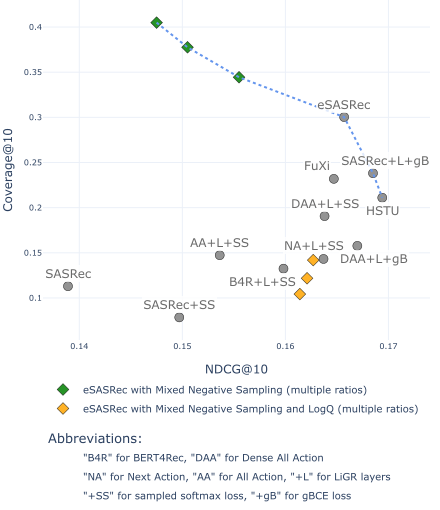

# "SASRec is Still Strong: Realistic Benchmarking of Modular Enhancements for Transformer-based Recommendations"

This repository contains code of a benchmarking framework for Transformer-based recommender systems. In our paper we challenge recent claims of substantial performance gains over classical architectures by:

- Introducing a modular approach to Transformer-based models, enabling interchangeable use of different layers, training objectives, loss functions, and negative sampling
- Providing realistic evaluation through time-based splits and beyond-accuracy metrics
- Demonstrating that enhanced SASRec architecture (SASRec+LiGR+SS) remains highly competitive

We borrow [RecTools](https://github.com/MobileTeleSystems/RecTools) implementations of backbone models SASRec and BERT4Rec and provide implementations of multiple [modular enhancements for Transformer-based models](src/models/transformers/) on top of them.

Our processed datasets with LOO and time-based splits can be downloaded [online](https://disk.yandex.ru/d/v7yUTbJXYvd0kA).

### Experimental results on two datasets from our benchmark, and the Pareto-front of top models


# Reproduce our results:
## Installation

Clone this repository.

Create virtual environment:
```
cd transformers_benchmark
python3 -m venv .venv
source .venv/bin/activate
```

Install required packages:
```
pip install -r requirements-dev.txt
pip install -e .
```

## Running Experiments

### 1. Getting datasets
To download and process a specific dataset, run:
```
python src/datasets/{dataset_name}.py
```
All datasets used in the paper:
```
python src/datasets/kion_r.py
python src/datasets/beeradvocate_r.py
python src/datasets/ml_1m.py
python src/datasets/ml_20m.py
python src/datasets/s3_repro.py         # LOO only
python src/datasets/bert_repro.py       # replication study
python src/datasets/s3_repro_w_time.py  # for HSTU and FuXi-𝛼
```

#### Validation Schemes
We support two validation approaches:
- Leave-one-out validation configured in [src/val_schemes/leave_one_out.py](src/val_schemes/leave_one_out.py)
- Time-based validation configured in [src/val_schemes/time_split.py](src/val_schemes/time_split.py)

Each dataset during processing is prepared for both validation schemes.

Alternatively, [download](https://disk.yandex.ru/d/v7yUTbJXYvd0kA) processed and splitted datasets, unzip and put datasets into `data/` directory following `data/<dataset_name>` folder structure.

### 2. Grid Search on Validation folds:
To find optimal parameters for each model:

1. Configure settings in [configs/grid_search/current.yaml](configs/grid_search/current.yaml), specifying datasets, validation schemes and model parameters. To run grid search over multiple parameter values, specify them under `search_parameters` key in the configuration file.
3. Run the grid search (evaluate on one or multiple folds before holdout fold):
```bash
python src/evaluation/grid_search.py
```

### 3. Evaluation on Holdout fold:
To evaluate models on the holdout fold:

1. Configure settings in [configs/holdout/current_params.yaml](configs/holdout/current_params.yaml). To run grid search over multiple parameters, specify them under `search_parameters` key in the configuration file.
3. Run the holdout evaluation:
```bash
python src/evaluation/holdout_from_params.py
```

To use different configuration file:
```bash
python src/evaluation/holdout_from_params.py --config_file <path_to_config_file>
```

### 4. Results Analysis
- Reports are saved in: `reports/{val_scheme}/{dataset_name}/{validation_type}/{report_file_name}.csv`

Reports directory structure:

```
reports/
├── {validation_scheme}/        # leave_one_out or time_split
│   └── {dataset_name}/         # e.g. ml_20m, s3_beauty
│       └── {validation_type}/  # grid_search or holdout
│           └── {report}.csv    # results file
```

- [Report example of holdout validation on BeerAdvocate-R dataset](reports/time_split/beeradvocate_r/holdout/paper.csv)

- To run holdout validation for best model from a specific "grid search" report:
  1. Configure settings in [configs/holdout/current_report.yaml](configs/holdout/current_report.yaml)
  2. Run the holdout evaluation of best model from grid search:
  ```bash
  python src/evaluation/holdout_from_report.py
  ```


### 5. All configuration files for holdout validation from our paper
- [Model configurations on multiple datasets and validation schemes](configs/paper/)

Full example to reproduce our results for one dataset (Kion-R) on time-based validation:
```
python src/datasets/kion_r.py
```
```bash
python src/evaluation/holdout_from_params.py --config_file configs/paper/kion_r/baselines.yaml
```
```bash
python src/evaluation/holdout_from_params.py --config_file configs/paper/kion_r/layer_and_losses.yaml
```
```bash
python src/evaluation/holdout_from_params.py --config_file configs/paper/kion_r/mixing.yaml
```
```bash
python src/evaluation/holdout_from_params.py --config_file configs/paper/kion_r/negatives.yaml
```
```bash
python src/evaluation/holdout_from_params.py --config_file configs/paper/kion_r/training_obj.yaml
```

### 6. Reproduce HSTU and FuXi-𝛼
Instructions to reproduce results for HSTU and FuXi-𝛼 models on our data splits are located in a [separate repository](https://anonymous.4open.science/r/hstu_benchmark-4530)

## Results
**Dataset summary statistic**
| Dataset | Users | Items | Interactions | Avg. Len. | 
| --- | --- | --- | --- | --- | 
| ML-1M-Unf | 6040 | 3706 | 1,000,209 | 165.6 | 
| ML-1M-Bert | 6040 | 3416 | 999,611 | 165.5 | 
| ML-20M-Unf | 138493 | 26744 | 20,000,263 | 144.4 | 
| Beauty-S3 | 22363 | 12101 | 198,502 | 8.9 | 
| Sports-S3 | 35598 | 18357 | 296,337 | 8.3 | 
| Toys-S3 | 19412 | 11924 | 167,597 | 8.6 | 
| Kion-R | 606743 | 10266 | 5,109,907 | 8.4 | 
| BeerAdvocate-R | 22679 | 22264 | 1,498,969 | 66.1 |

### Leave-One-Out Validation
For each user, we hold the final interaction for the test set
- **Movelens datasets**
### Performance Comparison

| Dataset | Scale | Metric | Reported | | | | Our | | Recalculated | |
|---------|-------|--------|----------|-|-|-|-----|-|--------------|-|
| | | | CBiT | SASRec MoL | HSTU | Fuxi-α | SASRec+SS | SASRec+LiGR+SS | HSTU | Fuxi-α |
| ML-1M-Unf | 1-4 layers | R@10 | 0.3013 | 0.3079 | 0.3097 | - | 0.2929 | 0.3133 | 0.3037 | **0.3164** |
| | | N@10 | 0.1694 | - | 0.172 | - | 0.1684 | 0.1772 | 0.1719 | **0.1813** |
| ML-20M-Unf | 1-4 layers | R@10 | - | 0.3114 | 0.3252 | 0.3353 | 0.3127 | 0.3289 | 0.3431 | **0.3553** |
| | | N@10 | - | - | 0.1878 | 0.1954 | 0.1829 | 0.1966 | 0.2029 | **0.2118** |
| ML-20M-Unf | 8 layers | R@10 | - | - | **0.3567** | 0.353 | 0.0465 | 0.3457 | ? | ? |
| | | N@10 | - | - | 0.2106 | 0.2086 | 0.0231 | **0.2107** | ? | ? |

- **Beaty, Sports and Toys datasets**

| Dataset | Metric | Reported | | | | | | | | Our | |
|---------|--------|----------|-|-|-|-|-|-|-|-----|-|
| | | S3Rec | LSAN | DuoRec | CL4SRec | CBiT | TIGER | ELMRec | ActionPiece | SASRec+SS | SASRec+LiGR+SS |
| Beauty-S3 | R@10 | 0.0647 | 0.0785 | 0.0845 | 0.0681 | 0.0905 | 0.0648 | 0.075 | 0.0775 | 0.0921 | **0.0928** |
| | N@10 | 0.0327 | 0.041 | 0.0443 | 0.0299 | **0.0537** | 0.0384 | 0.0529 | 0.0424 | 0.0531 | 0.0523 |
| Sports-S3 | R@10 | 0.0385 | 0.0481 | 0.0498 | 0.0387 | - | 0.04 | - | 0.05 | **0.0569** | 0.0560 |
| | N@10 | 0.0204 | 0.0264 | 0.0262 | 0.0171 | - | 0.0225 | - | 0.0264 | 0.0314 | **0.0323** |
| Toys-S3 | R@10 | 0.07 | 0.0711 | - | - | 0.0865 | 0.0712 | - | - | **0.0970** | 0.0939 |
| | N@10 | 0.0376 | 0.037 | - | - | 0.0535 | 0.0432 | - | - | **0.0580** | 0.0538 |

### Product-like validation
A time-based validation approach where data is split by global timestamp and the most recent interactions are used for testing.

- **ML-20M-Unf dataset**

| Modules | Model | HR@10 | N@10 | Coverage@10 | Debiased HR@10 | Debiased N@10 |
|---------|-------|-------|------|-------------|----------------|---------------|
| **Baselines** | Popular-7-days | 0.5699 | 0.1671 | 0.0061 | 0.1155 | 0.0184 |
| | SASRec Vanilla (BCE 1 neg) | 0.4856 | 0.1192 | 0.0829 | 0.2024 | 0.0371 |
| **SOTA models** | HSTU | **0.5977** | 0.1872 | 0.0535 | 0.1897 | 0.0316 |
| | FuXi-α | 0.5895 | **0.1883** | 0.0513 | 0.1788 | 0.0299 |
| **Layers & Losses** | SASRec+SS | 0.5354 | 0.1527 | 0.0913 | 0.2110 | **0.0394** |
| | SASRec+LiGR+SS | 0.5313 | 0.1563 | 0.0889 | 0.1978 | 0.0380 |
| | SASRec+LiGR+gBCE-0.75 | 0.5339 | 0.1479 | 0.1049 | **0.2162** | 0.0391 |
| **Negatives** | SASRec+LiGR+SS+Mixed-0.6 | 0.4753 | 0.1248 | **0.1076** | 0.1828 | 0.0353 |
| | SASRec+LiGR+SS+Mixed-0.6-LogQ | 0.4871 | 0.1358 | 0.0589 | 0.2059 | 0.0392 |
| | SASRec+LiGR+SS+InBatch | 0.0190 | 0.0020 | 0.0245 | 0.0109 | 0.0014 |
| **Training Obj.** | DenseAA-30-days+LiGR+SS | 0.5627 | 0.1668 | 0.0657 | 0.1868 | 0.0337 |
| | AllAction-60-days-Causal+LiGR+SS | 0.5504 | 0.1481 | 0.0063 | 0.1035 | 0.0156 |
| | NextAction-causal+LiGR+SS | 0.5159 | 0.1373 | 0.0329 | 0.1328 | 0.0217 |
| | BERT4Rec+LiGR+SS | 0.4907 | 0.1364 | 0.0808 | 0.1926 | 0.0351 |
| **Mixing** | DenseAA-30-days+LiGR+gBCE-0.75 | 0.5813 | 0.1762 | 0.058 | 0.1852 | 0.0327 |

- **Kion-R dataset**

| Modules | Model | HR@10 | N@10 | Coverage@10 | Debiased HR@10 | Debiased N@10 |
|---------|-------|-------|------|-------------|----------------|---------------|
| **Baselines** | Popular-7-days | 0.3728 | 0.142 | 0.0035 | 0.0153 | 0.0052 |
| | SASRec Vanilla (BCE 1 neg) | 0.3559 | 0.1389 | 0.113 | 0.0338 | 0.0106 |
| **SOTA models** | HSTU | 0.4200 | **0.1694** | 0.2110 | 0.0667 | 0.0218 |
| | FuXi-α | 0.4144 | 0.1647 | 0.2319 | 0.0678 | 0.0223 |
| **Layers & Losses** | SASRec+SS | 0.3801 | 0.1497 | 0.0785 | 0.0417 | 0.0136 |
| | SASRec+LiGR+SS | 0.4157 | 0.1657 | 0.3003 | 0.0825 | 0.0273 |
| | SASRec+LiGR+SS+gBCE-0.75 | **0.4205** | 0.1685 | 0.2381 | 0.0701 | 0.0233 |
| **Negatives** | SASRec+LiGR+SS+Mixed-0.6 | 0.3726 | 0.1475 | 0.4049 | **0.0918** | **0.0311** |
| | SASRec+LiGR+SS+Mixed-0.6-LogQ | 0.4042 | 0.1621 | 0.1218 | 0.0358 | 0.0111 |
| | SASRec+LiGR+SS+InBatch | 0.327 | 0.1283 | **0.6055** | 0.0776 | 0.0269 |
| **Training Obj.** | DenseAA-7-days+LiGR+SS | 0.4116 | 0.1638 | 0.1906 | 0.0691 | 0.0224 |
| | AllAction-14-days+LiGR+SS | 0.4029 | 0.1603 | 0.0812 | 0.0439 | 0.0133 |
| | NextAction+LiGR+SS | 0.4085 | 0.1627 | 0.0869 | 0.0624 | 0.0207 |
| | BERT4Rec+LiGR+SS | 0.3990 | 0.1586 | 0.0930 | 0.0631 | 0.0204 |
| **Mixing** | DenseAA-7-days+LiGR+gBCE-0.75 | 0.4195 | 0.1689 | 0.1046 | 0.0578 | 0.0181 |

- **BeerAdvocate-R dataset**

| Modules | Model | HR@10 | N@10 | Coverage@10 | Debiased HR@10 | Debiased N@10 |
|---------|-------|-------|------|-------------|----------------|---------------|
| **Baselines** | Popular-7-days | 0.2716 | 0.0575 | 0.0013 | 0.0470 | 0.0063 |
| | SASRec Vanilla (BCE 1 neg) | 0.1432 | 0.0222 | 0.0078 | 0.0519 | 0.0072 |
| **SOTA models** | HSTU | 0.2300 | 0.0473 | **0.1942** | 0.1243 | **0.0238** |
| | FuXi-α | 0.2367 | 0.0472 | 0.1904 | 0.1202 | 0.0234 |
| **Layers & Losses** | SASRec+SS | 0.2015 | 0.0381 | 0.0079 | 0.0752 | 0.0121 |
| | SASRec+LiGR+SS | 0.2974 | 0.0650 | 0.0771 | 0.1236 | 0.0223 |
| | SASRec+LiGR+gBCE-0.75 | 0.3014 | 0.0629 | 0.0737 | **0.1329** | 0.0228 |
| **Negatives** | SASRec+LiGR+SS+Mixed-0.2 | 0.2786 | 0.0590 | 0.0988 | 0.1294 | 0.0221 |
| | SASRec+LiGR+SS+Mixed-0.6 | 0.2762 | 0.0606 | 0.0746 | 0.1078 | 0.0183 |
| | SASRec+LiGR+SS+Mixed-0.6-LogQ | **0.3132** | **0.0690** | 0.0271 | 0.1089 | 0.0181 |
| | SASRec+LiGR+SS+InBatch | 0.1903 | 0.0310 | 0.0489 | 0.0563 | 0.0084 |
| **Training Obj.** | DenseAA-30-days+LiGR+SS | 0.2998 | 0.0635 | 0.0354 | 0.1041 | 0.0176 |
| | AllAction-60-days+LiGR+SS | 0.1754 | 0.0300 | 0.0020 | 0.0484 | 0.0176 |
| | NextAction+LiGR+SS | 0.2288 | 0.0423 | 0.0053 | 0.0570 | 0.0084 |
| | BERT4Rec+LiGR+SS | 0.2777 | 0.0561 | 0.0353 | 0.1102 | 0.0188 |
| **Mixing** | DenseAA-30-days+LiGR+gBCE-0.75 | 0.2798 | 0.0576 | 0.0283 | 0.1109 | 0.0179 |
